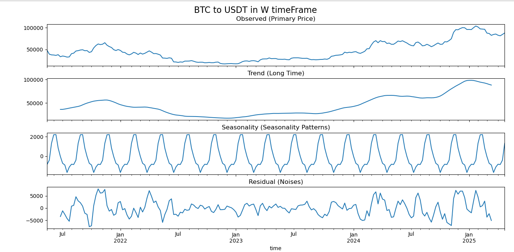

# 📊 Crypto Time Series Decomposition

This script performs time series decomposition on cryptocurrency price data. It helps you analyze **trend**, **seasonality**, and **random noise** components — useful for forecasting and pattern recognition in crypto markets.

---

## 🔧 Requirements

Make sure you have **Python** installed (version 3.7+ is recommended).

Then install required libraries using pip:

```bash
pip install cryptocompare pandas matplotlib statsmodels
```

---

## 🚀 How to Run

Use the following command to run the script:

```bash
python ./timeSeries.py BTC USDT W
```

### 🔢 Arguments

- **First parameter (`BTC`)** → Dependent variable (source crypto symbol)
- **Second parameter (`USDT`)** → Independent variable (target currency symbol)
- **Third parameter (`W`)** → Time frame  
  Example values:
  - `D` = Daily  
  - `W` = Weekly  
  - `M` = Monthly

---

## 📈 What It Does

The script fetches price data using **CryptoCompare**, resamples it based on your selected time frame, and then performs decomposition into:

- **Observed**: Original price values  
- **Trend**: Long-term direction  
- **Seasonality**: Repeating short-term patterns  
- **Residual**: Noise or randomness

You’ll get a clean matplotlib chart showing these components.

> 💡 You can also calculate and display **cyclical patterns** by enabling the cyclic component in the code.

---

## 📎 Notes

- Uses [`cryptocompare`](https://pypi.org/project/cryptocompare/) for real crypto data.
- Parameters are dynamic and handled using `argparse`.
- Useful for market trend analysis and early forecasting.

---

output example:



---

Happy analyzing and good luck with your crypto predictions! 🚀
